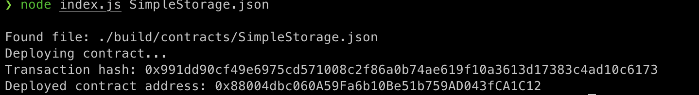

1. A screenshot of the console output immediately after you have successfully deployed a smart contract.



2. The transaction hash from the contract deployment (in text format).
```
0x991dd90cf49e6975cd571008c2f86a0b74ae619f10a3613d17383c4ad10c6173
```
3. The deployed contract address from the contract deployment (in text format).
```
0x88004dbc060A59Fa6b10Be51b759AD043fCA1C12
```