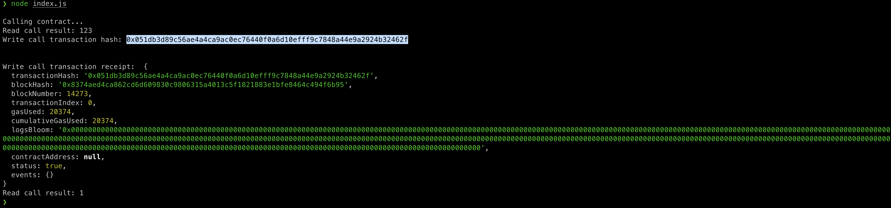

1. A screenshot of the console output immediately after you have successfully issued a smart contract call.

2. The transaction hash from the console output (in text format).
```
0x051db3d89c56ae4a4ca9ac0ec76440f0a6d10efff9c7848a44e9a2924b32462f
```
3. The contract address that you called (in text format).
```
0x88004dbc060A59Fa6b10Be51b759AD043fCA1C12
```
4. The ABI for contract you made a call on (in text format).
```
[
      {
      "inputs": [],
      "stateMutability": "payable",
      "type": "constructor"
    },
    {
      "inputs": [
        {
          "internalType": "uint256",
          "name": "x",
          "type": "uint256"
        }
      ],
      "name": "set",
      "outputs": [],
      "stateMutability": "payable",
      "type": "function"
    },
    {
      "inputs": [],
      "name": "get",
      "outputs": [
        {
          "internalType": "uint256",
          "name": "",
          "type": "uint256"
        }
      ],
      "stateMutability": "view",
      "type": "function"
    }
]
```