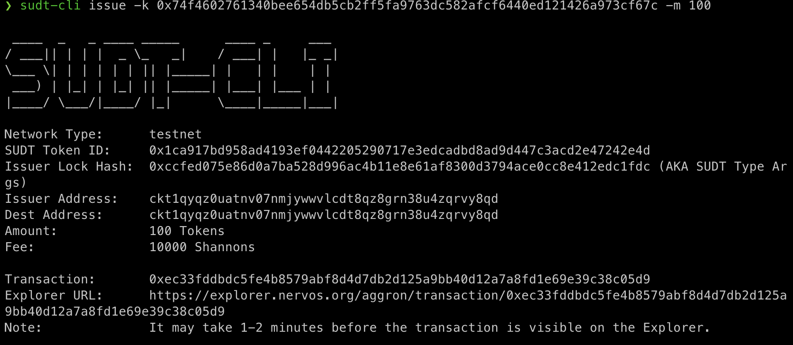
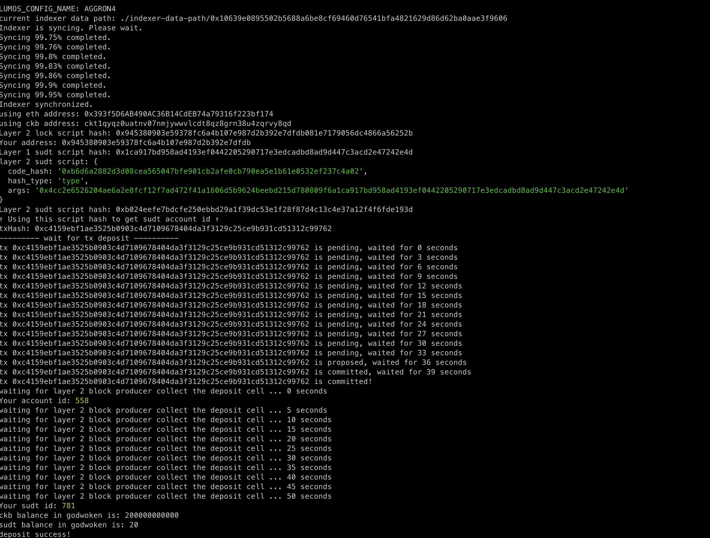

1. A link to the Layer 1 address you funded on the Testnet Explorer.
```
https://explorer.nervos.org/aggron/address/ckt1qyqz0uatnv07nmjywwvlcdt8qz8grn38u4zqrvy8qd
```
2. A screenshot of the console output immediately after using sudt-cli to create your SUDT tokens on Layer 1.


3. A link to the transaction ID created by sudt-cli on the Testnet Explorer.
```
https://explorer.nervos.org/aggron/transaction/0xec33fddbdc5fe4b8579abf8d4d7db2d125a9bb40d12a7a8fd1e69e39c38c05d9
```
4. A screenshot of the console output immediately after you have successfully submitted a deposit to Layer 2 using the account-cli tool.


5. The SUDT ID from the console output after executing the deposit script (in text format).
```
781
```