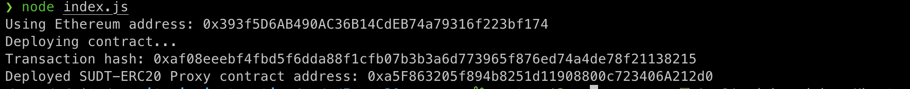

1. A screenshot of the console output immediately after deploying smart contract.


2. The address of the ERC20 Proxy Contract you deployed (in text format).
```
0xa5F863205f894b8251d11908800c723406A212d0
```
3. A screenshot of the console output immediately after checking your SUDT balance.

4. The Ethereum address that was checked (in text format).
```
0x393f5D6AB490AC36B14CdEB74a79316f223bf174
```