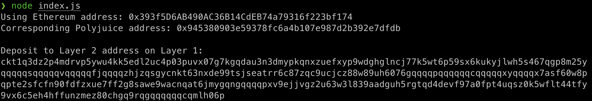

1. A screenshot of the console output immediately after you have successfully generated your Deposit Receiver Address.


2. Your Deposit Receiver Address (in text format).
```
ckt1q3dz2p4mdrvp5ywu4kk5edl2uc4p03puvx07g7kgqdau3n3dmypkqnxzuefxyp9wdghglncj77k5wt6p59sx6kukyjlwh5s467qgp8m25yqqqqqsqqqqqvqqqqqfjqqqqzhjzqsgycnkt63nxde99tsjseatrr6c87zqc9ucjcz88w89uh6076gqqqqpqqqqqqcqqqqqxyqqqqx7asf60w8pqpte2sfcfn90fdfzxue7ff2g8sawe9wacnqat6jmygqngqqqqpxv9ejjvgz2u63w3l839aadguh5rgtqd4devf97a0fpt4uqsz0k5wflt44tfy9vx6c5eh4hffunzmez80chgq9rqgqqqqqqcqmlh06p
```
3. The Ethereum address used to generate the Deposit Receiver Address (in text format).
```
0x393f5D6AB490AC36B14CdEB74a79316f223bf174
```
4. A link to the Etherscan explorer for the successful Force Bridge transaction. This can be found on Force Bridge under History→Succeed.
```
https://rinkeby.etherscan.io/tx/0xdeebe22558ad459fe43d77ad44f4e107e0925ca8eb7e78838258c743a3d47b07
```
5. A link to the Nervos explorer for the successful Force bridge transaction. This can be found on Force Bridge under History→Succeed.
```
https://explorer.nervos.org/aggron/transaction/0x08b175fe6c860af16fa153028b0e6356492f88e00f0a6752477d9c2f882683cd
```