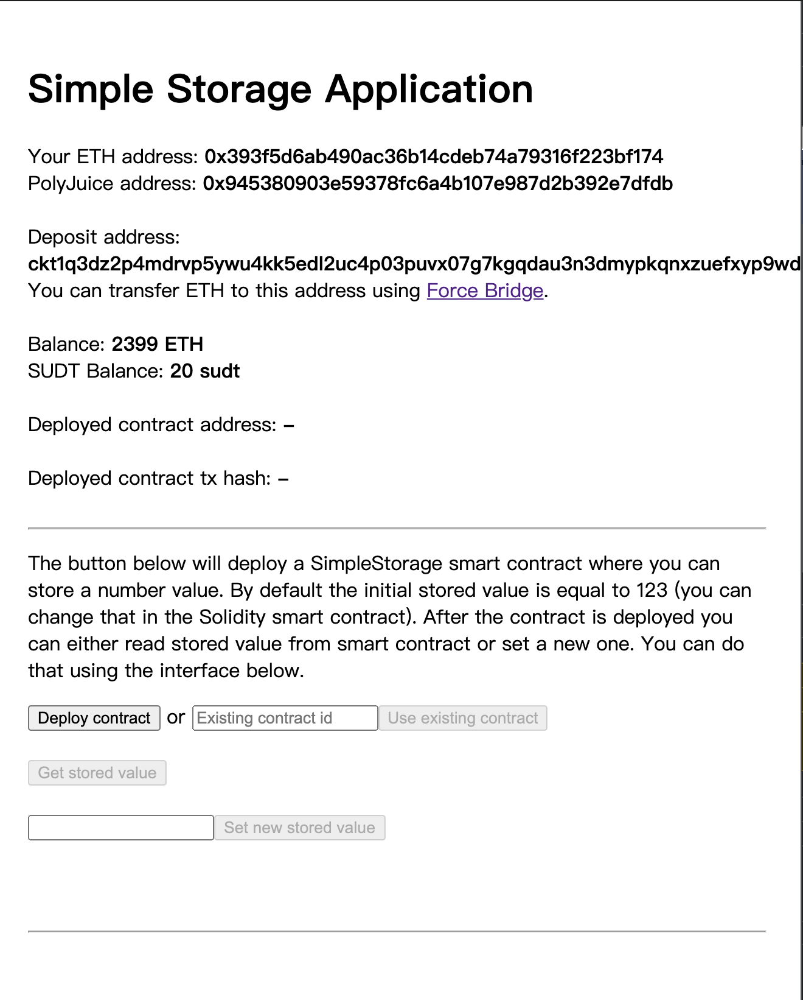

1. A screenshot or video of your EVM application on Layer 2 with Force Bridge support.



2. The address of the SUDT-ERC20 Proxy Contract that you deployed (in text format).
```
0xa5F863205f894b8251d11908800c723406A212d0
```

3. A link to the GitHub repository with your EVM application that integrates Force Bridge support.
```
https://github.com/sking789/godwoken_test_dapp/tree/task8
```